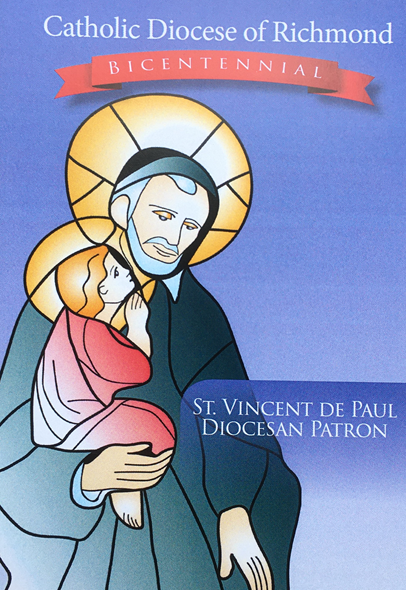

“Anh em phải chiếu sáng như những vì sao trên vòm trời, 
là làm sáng tỏ Lời ban sự sống.” (Phil 2: 15-16)

_Ngày 11 tháng 7 năm 2020_
 
Anh chị em tín hữu trong Giáo phận thân mến,
 
Hôm nay chúng ta tưởng nhớ đến Giáp hội địa phương của chúng ta được thiết lập 200 năm trước đây và chúng ta nhận ra sự hiện diện của Giáo hội Công giáo tại miền đất Trung tâm của Giáo phận.
 
Giáo hội Công Giáo tại Virginia đã kinh nghiệm một giai đoạn đầy biến động được dẫn dắt bởi Đức Thánh Cha Piô VII để thiết lập Giao phận Richmond vào ngày 11 tháng 7 năm 1820. Tài liệu thiết lập Giáo phận xác nhận như sau: “Giáo phận này được thiết lập nhằm mục đích giải quyết sự chia rẽ hiển nhiên của các tín hữu đang khởi phát lên tại Norfolk về quyền sở hữu tài sản của Giáo hội và bổ nhiệm các cha xứ.”
 
Theo như văn bản của hiến chương của chúng ta, “Bởi vì rất phù hợp để giảm bớt những bất đồng chia rẽ xuất hiện trong Giáo hội … Chúng tôi … thiết lập và ban hành sắc lệnh: … Một Tân Giáo phận … được thiết lập tại Richmond .. và Giáo phận này sẽ bao gồm toàn bộ Tiểu Bang Virginia.
 
Dĩ nhiên qua hai thế kỷ, các tín hữu trong Giáo phận Richmond đã đạt được một vài thành tích và thành công, nhưng họ cũng kinh nghiệm được khó khăn và thất bại. Trải qua thời gian này, Giáo phận luôn kiên trì hy vọng. Kỷ niệm 200 năm của chúng ta là một chiếu sáng chứng nhân của Đức Tin Công Giáo.
 
Thực tế cho thấy, biến cố 200 năm của Giáo phận đang ở trong giai đoạn đầy lo âu sợ hãi nhắc nhở rằng: Chúng ta là những thành phần của một truyền thống Đức Tin. Trong vài tháng gần đây, dịch COVID-19 đã bùng phát trên thế giới. Gần gũi hơn nữa, những lời kêu gọi cho công lý sắc tộc vang động trong quốc gia của chúng ta giữa xã hội đầy biến động. Trong cả hai trường hợp, Giáo hội tiếp tục công bố Tin Mừng của Đức Kitô, Đấng đã chịu chết và Phục Sinh, thúc đẩy chúng ta làm giảm bớt đau khổ và thất vọng, cũng như cỗ võ phẩm giá của tất cả mọi người.
 
Cuối tuần này sẽ truyền chức cho hai ứng viên Linh mục và một ứng viên phó tế chuyển tiếp là dấu chỉ hy vọng của những công việc Giáo phận đang tiếp tục. Với niềm tri ân khi Giáo phận thiết lập, và 200 năm của các chứng nhân Công Giáo, tôi yêu cầu một Thánh Lễ chính thức đặc biệt được lấy từ Sách Lễ Roma (Tạ ơn Thiên Chúa) được sử dụng trong toàn Giáo phận vào cuối tuần.
 
Theo bước chân của những người đã ra đi trước trong Đức Tin, ước mong thực hiện những việc Thiên Chúa trao cho chúng ta, làm viên mãn những lời trong câu châm ngôn 200 năm của Giáo phận: “Anh em phải chiếu sáng như những vì sao trên vòm trời, là làm sáng tỏ Lời ban sự sống.” (Phil 2: 15-16)
 
Thân mến trong Chúa Kitô,
 
**Đức Cha Barry C. Knestout Giám mục Richmond**

**KINH 200 NĂM GIÁO PHẬN RICHMOND** 
“Hãy Chiếu sáng như những vì sao” [Pl 2:15–16].
 (1820 - 2020)
 
Lạy Cha là Đấng dựng nên muôn tinh tú, /
Ánh Sáng của Con Cha / đã dẫn dắt và củng cố công cuộc rao giảng Tin Mừng / 
của Giáo phận chúng con, / từ Đông sang Tây, / qua hai thế kỷ. /
 
Đang khi mong đợi ngày Quang lâm của Đức Kitô gần đến, /
Xin xua tan mọi bóng đêm tội lỗi, /  để lòng mến của chúng con /
ngày một thêm dồi dào; / và hơn bao giờ hết, /
chúng con mạnh dạn rao giảng Lời Chúa / mà không hề sợ hãi. /
 
Xin cho chúng con làm sáng tỏ Lời ban sự sống /
và chiếu sáng lên / như những vì sao trong thế giới hôm nay.
 
Chúng con cầu xin, / nhờ Đức Giêsu Kitô, Con Chúa, là Thiên Chúa, /
và là Chúa chúng con, / Người hằng sống và hiển trị cùng Chúa, /
hợp nhất với Chúa Thánh Thần đến muôn thuở muôn đời. / Amen.
 
(Cộng đoàn sẽ đọc sau khi rước lễ trong các Thánh Lễ cuối tuần này)

Ghi danh và đến tham dự Thánh Lễ mừng Kỷ niệm 200 Năm thiết lập Giáo phận Richmond tại Giáo xứ
 
Theo hướng dẫn của Đức Giám mục Barry C. Knestout, cuối tuần này Giáo xứ cử hành Thánh Lễ Kỷ niệm 200 Năm thiết lập Giáo phận với 3 Thánh Lễ như thường lệ: Thứ Bẩy 8:00PM; Chúa Nhật 8:00AM và 10:30AM. Để sắp xếp phù hợp số người tham dự mỗi Thánh Lễ và tránh đi những phiền phức về y tế sức khỏe có thể xảy ra, nên cộng đoàn cần ghi danh tại trang nhà: www.chungnhan.org hoặc  https://ghidanh.chungnhan.org
 
**Lưu ý**:  
(1) Mỗi Chúa Nhật đi tham dự Thánh Lễ: Đều phải ghi danh 
(2) Những ai đã ghi danh nhưng thay đổi giờ tham dự Thánh Lễ: Cần ghi danh lại. 
(3) Những ai đã ghi danh và muốn tham dự Thánh Lễ cuối tuần kế tiếp: Chỉ gặp ban hướng dẫn tại cuối Nhà Thờ, và ghi danh trực tiếp nơi đây, nghĩa là không cần vào trang nhà của Giáo xứ nữa.  
(4) Ghế trong Nhà Thờ có chỗ dành cho các gia đình. Do đó, những gia đình nào muốn ngồi chung với nhau, xin báo cho ban hướng dẫn biết tại bàn tiếp đón. 
 
+ + +
 
Văn phòng Giáo xứ 
Các Thánh Tử Đạo Việt Nam, Richmond VA    
